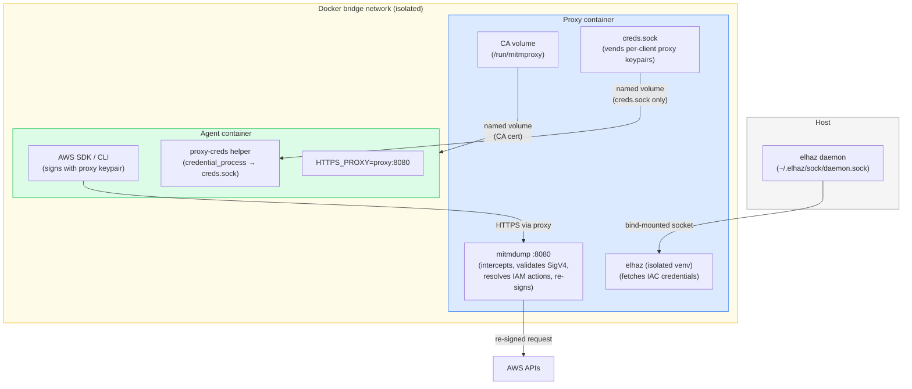

# aws-sigv4-resigning-proxy



A **credential injection proxy** for AWS: the agent holds proxy-issued fake AWS keys with no IAM identity, and the proxy re-signs outbound requests with real credentials the agent never sees. Isolation is a property of the environment, not the agent — the agent cannot misuse credentials it does not hold.

This uses [mitmproxy](https://mitmproxy.org/) under the hood, with [elhaz](https://github.com/61418/elhaz) as the IAM Identity Center credential source. See the [blog post](./BLOG.md) for the conceptual background on credential injection proxies as a pattern.

## How it works

**Credential carrier** — the proxy generates fake-but-syntactically-valid AWS keypairs and vends them to agent clients over a Unix socket (`creds.sock`). There is no IAM identity behind these keys. Each socket connection gets its own distinct keypair so the proxy can tell clients apart. The agent's AWS SDK uses the keypair to sign requests; if the keypair leaks, it is useless to AWS.

**Local SigV4 validation** — the proxy recomputes the HMAC-SHA256 signature from the inbound request and looks up the signing secret by `access_key_id`. Requests signed with unknown or mismatched keys are rejected with a forged `InvalidClientTokenId` 403 before any IAC credential fetch occurs.

**Docker isolation** — the agent container gets only `creds.sock` and the mitmproxy port. No elhaz socket, no IAC credentials, no host network access. The proxy is the agent's only path to AWS.

**Recording mode** — every validated request is forwarded and the proxy logs the resolved IAM action(s). Run the agent against a representative workload, collect the log, and you have a least-privilege policy derived from what the agent actually called rather than what someone guessed it would need.

**Enforcement mode** — set `PROXY_MODE=enforce` and point `ALLOWLIST_PATH` at an IAM policy JSON file. The proxy resolves each request to IAM action strings, checks them against the allowlist, and returns a forged `AccessDenied` 403 for anything not permitted. The agent cannot distinguish a proxy-enforced denial from a real IAM denial.

## Quickstart

<!-- Quickstart is being rewritten alongside new functionality — placeholder intentional -->

*Coming soon: updated quickstart covering the new setup flow.*

## Configuration

| Env var | Default | Description |
|---|---|---|
| `ELHAZ_CONFIG_NAME` | `sandbox-elhaz` | elhaz config name for the IAC role |
| `ELHAZ_SOCK` | `~/.elhaz/sock/daemon.sock` | Host path to the elhaz daemon socket |
| `ELHAZ_CONFIG_DIR` | `~/.elhaz/configs` | Host path to elhaz config files |
| `ELHAZ_SOCKET_PATH` | `/tmp/elhaz.sock` | Socket path inside the proxy container |
| `PROXY_SOCK_PATH` | `/run/proxy/creds.sock` | Unix socket path for credential vending |
| `PROXY_KEYPAIR_TTL` | `3600` | Proxy keypair lifetime in seconds |
| `PROXY_MODE` | `record` | `record` (forward all) or `enforce` (check allowlist) |
| `ALLOWLIST_PATH` | *(required in enforce mode)* | Path to IAM policy JSON allowlist |

Override defaults in `.env` or by prefixing `docker compose up`:

```bash
ELHAZ_CONFIG_NAME=my-agent-role docker compose up -d
```

## Switching to enforcement mode

After running the agent in recording mode, collect the observed actions and author an allowlist:

```bash
# Pull resolved actions from proxy logs
docker compose logs proxy | grep "Resolved actions" > actions.txt

# Author a policy.json from the observed actions, then:
PROXY_MODE=enforce ALLOWLIST_PATH=/path/to/policy.json docker compose up -d
```

The `ALLOWLIST_PATH` file is standard IAM policy JSON — the same format you'd pass to `aws iam put-role-policy`. Enforcement mode is still evolving; see [DESIGN.md](./DESIGN.md) for the full rationale.

## Appendix: why IAM Identity Center roles require a proxy

AWS IAM Identity Center roles live under `/aws-reserved/` and return `UnmodifiableEntity` on any attempt to modify their trust policy. The trust policy allows only `sts:AssumeRoleWithSAML` from the SAML provider — self-assumption is blocked. Session policies (which require an `AssumeRole` call the trust policy must permit) are also unreachable.

The proxy is the workaround: it holds an elhaz session for the IAC role and re-signs outbound requests. The agent authenticates to the proxy, not to AWS directly.

See [DESIGN.md](./DESIGN.md) for the full architecture and design rationale.
